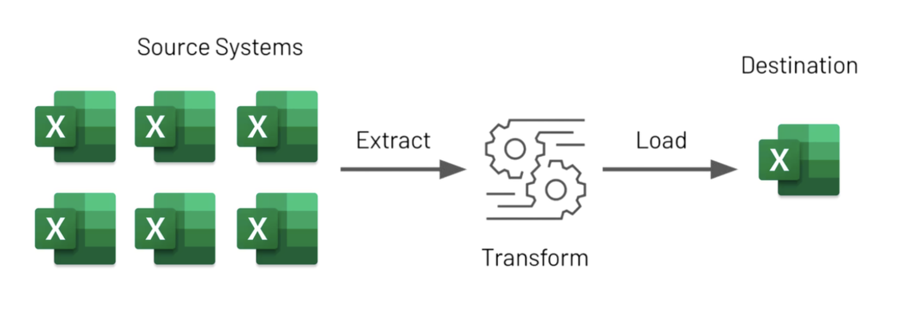

# Doc 'Como estruturar um projeto do Zero'

Este é um projeto exemplo dedicado a demonstrar práticas de refatoração. Neste espaço, você encontrará uma descrição aprofundada da ETL, instruções para instalação, respostas a perguntas frequentes e mais. Seja você um colaborador ou simplesmente alguém com interesse no projeto, esperamos que esta documentação lhe seja útil.

Além disso, esta documentação pode ser integrada ao Confluence ou a uma intranet interna, facilitando o acesso e colaboração de todos os membros da equipe.

## Seções

- [Doc 'Como estruturar um projeto do Zero'](#doc-como-estruturar-um-projeto-do-zero)
  - [Seções](#seções)
  - [Introdução](#introdução)
  - [Guia de Instalação](#guia-de-instalação)
  - [FAQ](#faq)
  - [Contato](#contato)

## Introdução

O objetivo deste projeto é demonstrar como técnicas de refatoração podem ser aplicadas para melhorar a qualidade do código, otimizar a performance e tornar o software mais manutenível. A refatoração é essencial para manter o código limpo e compreensível, permitindo que equipes mantenham uma alta velocidade de desenvolvimento ao longo do tempo.

## Guia de Instalação

Aqui, você encontrará instruções detalhadas sobre como instalar e configurar o projeto em seu ambiente local. Seguir as instruções corretamente garante que você tenha uma experiência suave ao trabalhar no projeto.

## FAQ

Esta seção fornece respostas para perguntas frequentes. Se você tiver alguma dúvida que não está coberta aqui, sinta-se à vontade para entrar em contato.

## Contato

Para quaisquer dúvidas, feedbacks ou suporte relacionado ao projeto, você pode entrar em contato diretamente através do e-mail: [lvgalvaofilho@gmail.com](mailto:lvgalvaofilho@gmail.com). Estou sempre disposto a ajudar!
